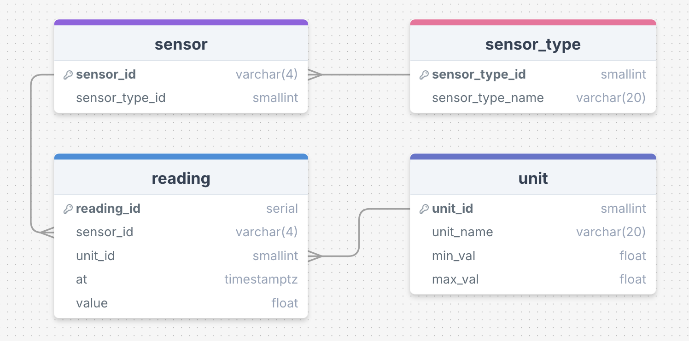

# IoT Server PostgreSQL Schema

## Overview
This folder contains SQL scripts and related files necessary for creating and maintaining the PostgreSQL database used by the IoT sensor server.

## Entity-Relationship Diagram (ERD)

The database structure is visually represented in the following ERD:



---

## Files Explained
- `schema/ERD.png`: Entity relationship diagram of the IoT sensor server schema.
- `schema/schema.sql`: SQL script to define and create the IoT sensor server schema.
- `schema/reset-db.sh`: Bash script to clear all data from the database tables.

## Setup

### Prerequisites
- **PostgreSQL** installed and running on your system.
- **Access to `psql`**,
- **A valid PostgreSQL user** with privileges to create and manage the database.

### Installation Steps

**Run the following commands from the repository's root:**

1.
   ```bash
   cd schema
   ```
2.
   ```bash
   psql -U <YOUR_USERNAME> -f schema.sql
   ```

3. (Optional) Verify that the tables were created successfully by connecting to the database and listing the tables:
   ```bash
   psql -U <YOUR_USERNAME> -d iot_sensors
   >> \dt
   ```
